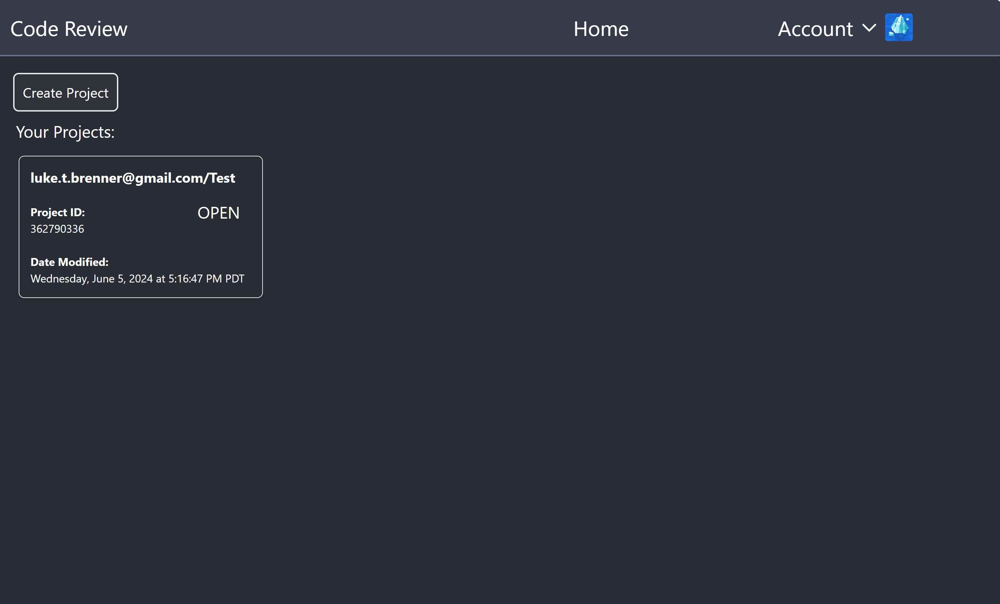
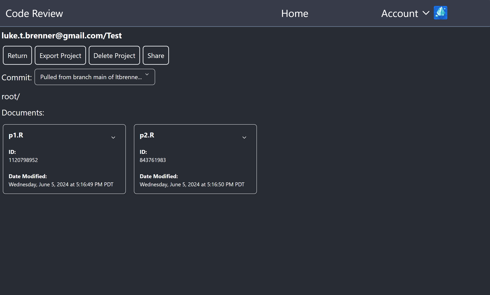
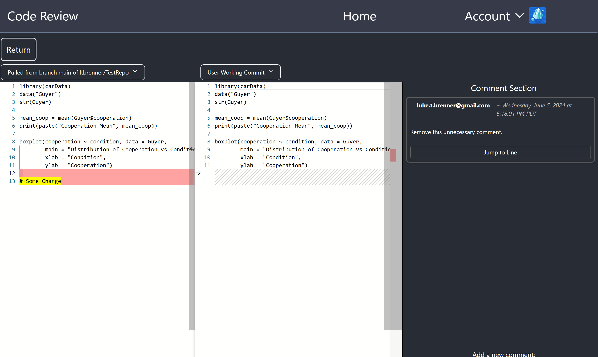
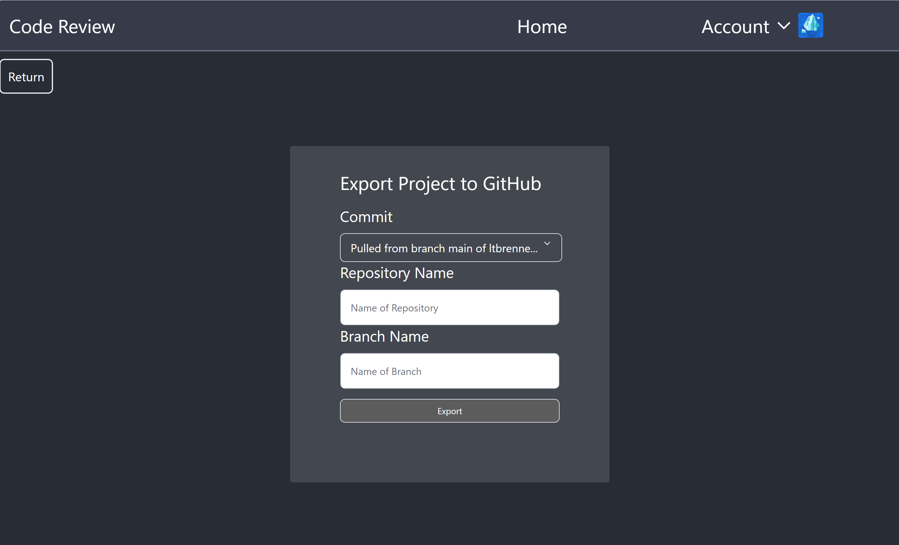

# Code Review UI

## Description
This react project provides an intuitive way to interact with, and uitlize the functionality implemented by the Flask Backend.

With it, users can import code repositories from GitHub, add and modify files as necessary throughout the code review, and finally export the modified project back to GitHub.

## Features
- Google Oauth Authentication
- GitHub Account Connection and Integration
- Code Review Creation
- Code Review Collaberation
- Code Review State Management
- Code Rview Exporting

## Screenshots

## Technologies Used
- React
- React Router
- Tailwind CSS
- Flowbite Component Library
- Jest